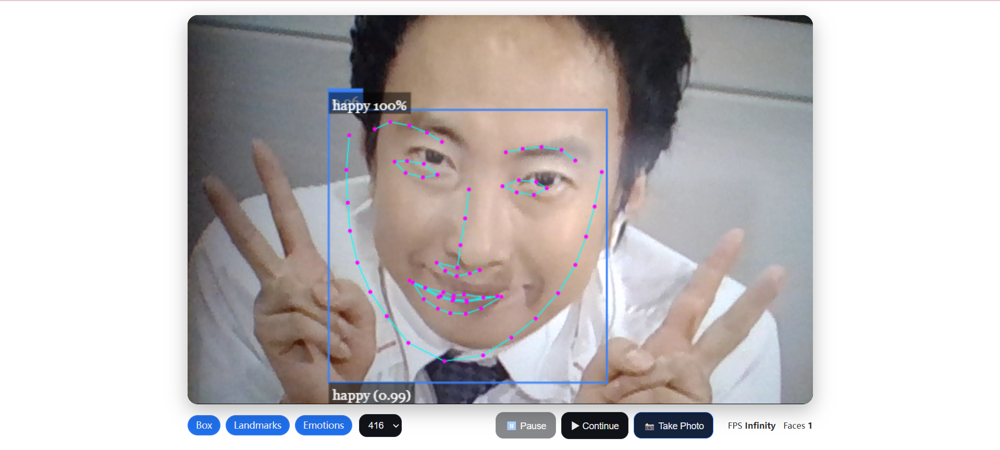
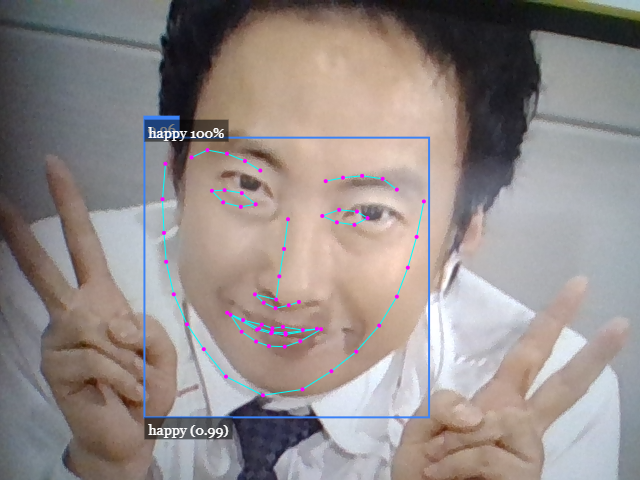
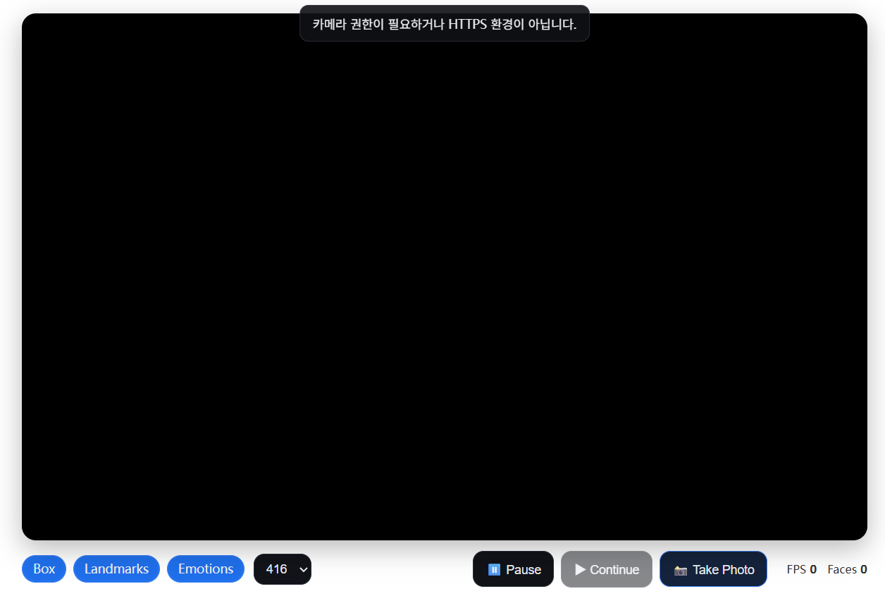

# Real-Time Face Detection (HTML + JavaScript + face-api.js)

A browser-based project that performs **real-time face detection, facial landmark tracking, and expression recognition** using [face-api.js](https://github.com/justadudewhohacks/face-api.js).  
The UI places clean **chip-style toggles and buttons** directly below the video feed (inspired by iPhone Camera roll controls).

> ⚠️ Camera access works only in **HTTPS environments** or via **http://localhost**.

---

## Features

- **Real-time face detection** using TinyFaceDetector  
- **Overlay toggles**
  - **Box** → Detection box + confidence score  
  - **Landmarks** → 68-point facial landmarks  
  - **Emotions** → Top-1 expression label (`happy 99%`) + probability bar chart  
- **Resolution selector** (320 / 416 / 512) for performance vs. accuracy tradeoff  
- **Playback controls**: ⏸ Pause / ▶ Continue  
- **Capture**: 📸 Take Photo → saves combined video + overlay as PNG  
- **Statistics**: FPS (smoothed EMA) and number of detected faces  
- **Auto pause/resume** when the browser tab is hidden/visible  
- **Resource cleanup**: Camera tracks automatically stopped on page unload  

---

## Demo Screenshots

### Live detection (webcam + overlays)


### 📸 Capture result (via **Take Photo** button)


---

## Project Structure

```text
REAL-TIME-FACE-DETECTION-UPGRADE/
├─ models/
│  ├─ face_expression_model-shard1
│  ├─ face_expression_model-weights_manifest.json
│  ├─ face_landmark_68_model-shard1
│  ├─ face_landmark_68_model-weights_manifest.json
│  ├─ face_landmark_68_tiny_model-shard1
│  ├─ face_landmark_68_tiny_model-weights_manifest.json
│  ├─ face_recognition_model-shard1
│  ├─ face_recognition_model-shard2
│  ├─ face_recognition_model-weights_manifest.json
│  ├─ tiny_face_detector_model-shard1
│  └─ tiny_face_detector_model-weights_manifest.json
│
├─ face-api.min.js          # face-api.js library
├─ index.html               # UI and layout
├─ script.js                # Detection logic and rendering
└─ README.md
```

---

## Getting Started

### 1) Clone the repository

### 2) Place model files
The `/models` folder must contain the following (already included in this project):

- `tiny_face_detector`
- `face_landmark_68`
- `face_landmark_68_tiny`
- `face_expression`
- `face_recognition` *(optional, loaded for compatibility)*

---

### 3) Run a local server
Browser camera APIs do not work with `file://`. Run a local dev server.

- **Python 3**
  ```bash
  python -m http.server 5500
  ```
Then visit: http://localhost:5500

- **Node (http-server)**
  ```bash
    npx http-server -p 5500
  ```

- **VS Code Live Server**
- Open the project in Visual Studio Code
- Right-click index.html → “Open with Live Server”
- The browser will open at http://127.0.0.1:5500
- Allow camera access and start detection

---

### 4) Open in browser
- Navigate to the local server URL
- Allow camera access
- The top toast will disappear once models & camera initialize
- Start interacting with overlays and controls

---

## UI Guide

- **Chips**
  - **Box** → Shows detection boxes + confidence scores  
  - **Landmarks** → 68-point facial landmarks  
  - **Emotions** → Displays top-1 expression label (`happy 100%`) and probability bar chart  

- **Resolution** → Select between 320 / **416 (default)** / 512  
- **⏸ Pause / ▶ Continue** → Pause or resume the detection loop  
- **📸 Take Photo** → Save current frame + overlays as PNG  
- **Stats** → Displays FPS and number of detected faces  
- **Live dot** → Red (stopped), Green (running)  

## 🖼 Demo Screenshots

### ⚙️ UI layout (initial screen, no camera permission)


### Live detection (webcam + overlays)


### 📸 Capture result (via **Take Photo** button)


---

## Implementation Notes

- **Detector options**
  ```js
  new faceapi.TinyFaceDetectorOptions({
    inputSize: Number(selInputSize.value || 416),
    scoreThreshold: 0.5
  });
  ```

- **Top-1 expression label**
  ```js
    const sorted = d.expressions.asSortedArray();
    const best = sorted[0]; // { expression, probability }
    new faceapi.draw.DrawTextField(
    [`${best.expression} ${Math.round(best.probability * 100)}%`],
    { x, y: Math.max(0, y - 18) }
    ).draw(canvas);
  ```

- **Capture function** → Merges video + overlay canvas into a single PNG download  
- **Tab visibility API** → Automatically pauses when hidden and resumes when visible  
- **Cleanup** → Camera tracks are stopped on `beforeunload`  

---

## Privacy

- All inference runs locally in the browser (WebGL/Canvas).  
- No video data is sent to external servers unless explicitly implemented.  

---

## Troubleshooting

- **No camera prompt** → Ensure HTTPS/localhost and check browser site permissions  
- **No overlays shown** → Verify `/models` folder path and file existence  
- **No expression labels** → Ensure Emotions toggle is enabled  
- **Low FPS / overheating** → Use smaller resolution (e.g., 320), reduce loop frequency, or disable overlays  
- **iOS Safari issues** → Safari has stricter autoplay/permission rules (muted + playsinline attributes are already set)  

---

## License

MIT © [luckiepie](https://github.com/luckiepie)

---

## Credits

- [face-api.js](https://github.com/justadudewhohacks/face-api.js) (MIT License)  
- Pre-trained model files (`/models`) and `face-api.min.js` are distributed from the **face-api.js** GitHub repository.  
- Project UI/logic (`index.html`, `script.js`) customized and implemented by [luckiepie](https://github.com/luckiepie).


